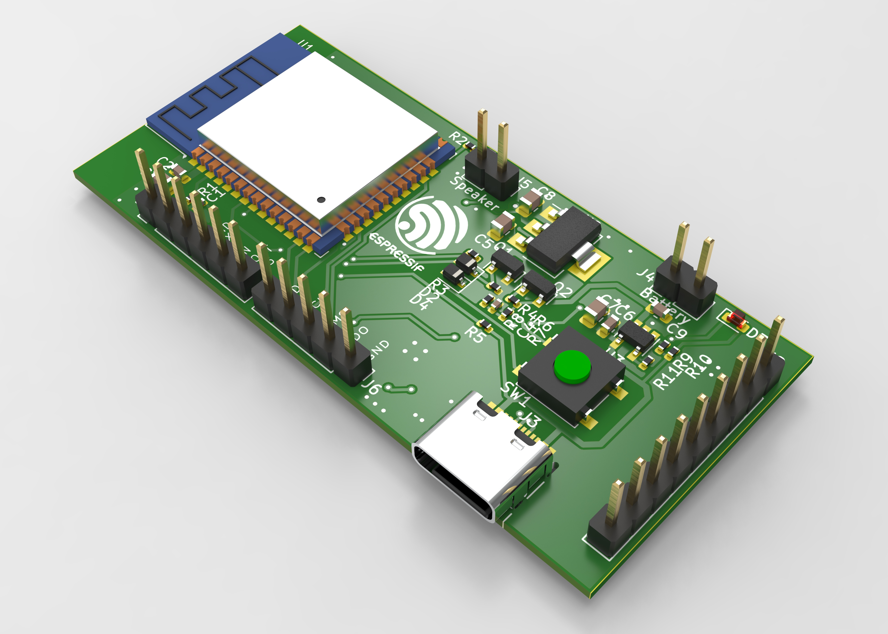

# hanshow E-ink example based on ESP32

An assistant to help you view text and picture calendars. It is mainly composed of a 2.13 inch eink(epaper) and an esp32 module.

[ESP32](https://www.espressif.com/zh-hans/products/socs/esp32) of espressif is used as the controller, and development environment is [esp-idf v4.0](https://github.com/espressif/esp-idf/tree/release/v4.0).

## How to Use

1. setup environment

   [ESP-IDF Programming Guide](https://docs.espressif.com/projects/esp-idf/en/latest/esp32/get-started/index.html#installation-step-by-step) will teach you to install the development environment step by step.

2. config project

   open the menuconfig

   ```shell
   cd firmware
   idf.py menuconfig
   ```

    Here you can configure the project. For example, you can change the GPIO of the screen by entering `component config → Eink setting ` .

3. compile project

   ```shell
   idf.py build
   ```

4. download firmware

   ```shell
   idf.py -b 921600 flash monitor
   ```

   The above command will flash esp32 and open a serial monitor to show the logs of esp32.

## File Structure

```shell
.
├── datasheet  #related documents
├── firmware   #firmware of esp32
├── hardware   #PCB project of KiCAD
├── LICENSE
├── README.md
└── tools
```


## Hardware

### Resource on board

- ESP32-WROOM module
- Audio PA，can be input by PWM or DAC
- Type-C for battery charge and download firmware to ESP32
- Design of power supply with complete shutdown




### Known issues of hardware

[hardware\bugfix.md](hardware/bugfix.md)

